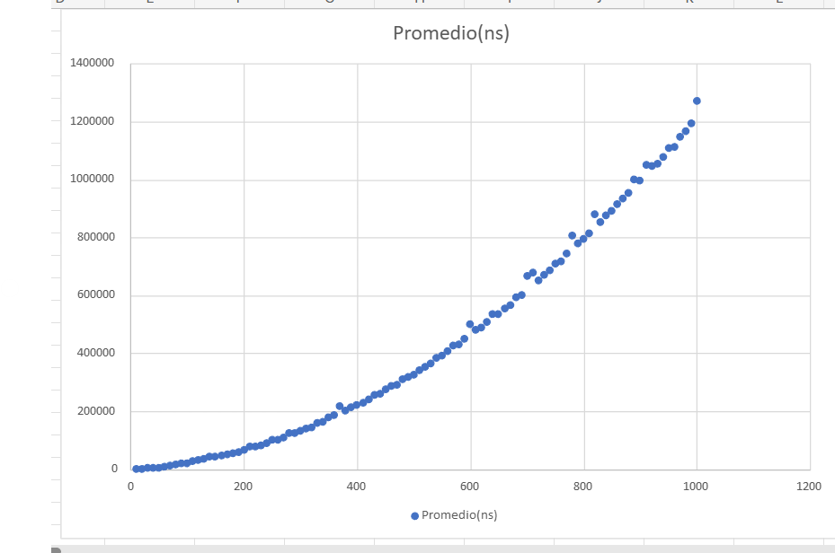
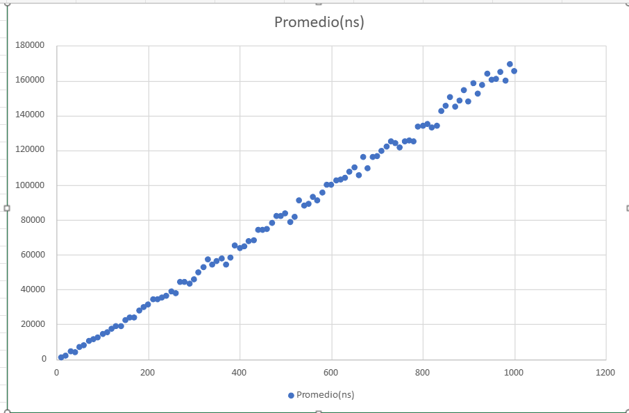
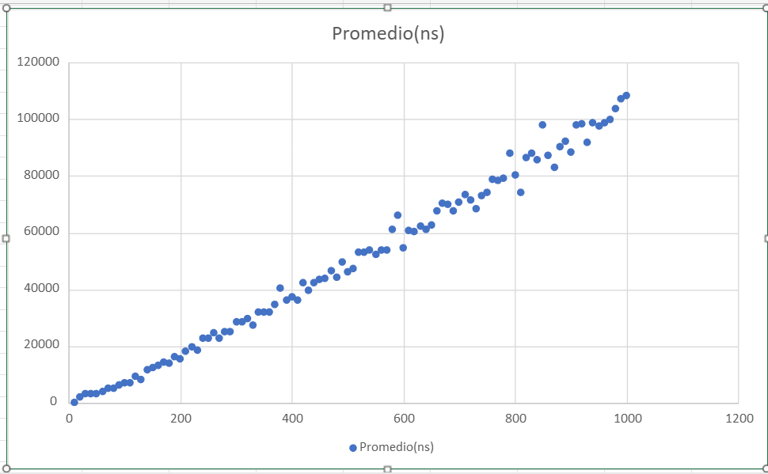

# Algoritmos-ordenamiento-Analisis
El programa cuenta con 7 algoritmos de Ordenamiento en c++, los cuales ejecutan en distintas dimensiones para conseguir un promedio, promedios los cuales para cada algoritmo son devueltos en archivo csv, y con la cual se realiza una gráfica para cada sistema de Ordenamiento.
Proyecto de Análisis de Rendimiento de Siete Algoritmos de Ordenamiento
Este proyecto implementa y compara el tiempo de ejecución de siete algoritmos clásicos de ordenamiento:

Inserción

Burbuja

Selección

Shell

Mezcla (Merge Sort)

Rápido (Quick Sort)

Montículos (Heap Sort)

El objetivo principal es observar cómo se comportan cada uno de estos algoritmos conforme crece el tamaño de los arreglos, recopilando datos sobre sus tiempos de ejecución y permitiendo un análisis comparativo.

1. Requisitos del Sistema
Un compilador C++ compatible con C++11 o superior (por ejemplo, g++ 7+, Clang 6+, MSVC 2015+).

Sistema operativo Windows, Linux o macOS.

(Opcional) Python, Excel, LibreOffice, Google Sheets para graficar y analizar los archivos CSV generados.

2. Estructura de Archivos
main.cpp (o un conjunto de archivos .cpp y .hpp) con la implementación de los siete algoritmos y la función principal:

Inserción

Burbuja

Selección

Shell

Mezcla

Rápido

Montículos

3. Compilación y Ejecución
Descarga o clona el repositorio en tu máquina.

Abre la carpeta del proyecto en una terminal.

Compila el archivo principal (por ejemplo main.cpp) con el compilador de tu preferencia.

4. Funcionamiento del Programa
4.1 Resumen de la Lógica
El programa define constantes para:

NUM_PRUEBAS = 1000 (cuántas veces repetimos la prueba por cada tamaño),

MIN_TAMANO = 10, MAX_TAMANO = 1000, INCREMENTO = 10 (definen los tamaños de arreglo).

Para cada uno de los 7 algoritmos, el programa:

Recorre los tamaños (10, 20, 30, ..., 1000).

Genera 1000 arreglos aleatorios de ese tamaño.

Mide el tiempo de ejecución (en nanosegundos) sumando las 1000 mediciones.

Calcula el promedio.

Imprime en consola: “Tamaño: X => Promedio: Y ns”.

Al final, se guardan estos promedios en un archivo CSV con nombre n_[NombreAlgoritmo]_Ordenamiento.csv (uno por cada algoritmo).

4.2 Archivos CSV Generados
Para cada algoritmo, se produce un archivo con esta estructura (ej. 1_Insercion_Ordenamiento.csv):

Tamanio,Promedio(ns)
10,12345
20,23456
...
1000,987654

La primera fila tiene los encabezados: Tamanio,Promedio(ns).

Cada fila posterior muestra el tamaño y el tiempo promedio de las 1000 iteraciones en nanosegundos.
## Archivos CSV de Resultados por Algoritmo

Cada archivo contiene los **tiempos promedio de ejecución** para arreglos de tamaños entre 10 y 1000, evaluados en 1000 pruebas.

- [📄 Inserción](./1_Insercion_Ordenamiento.csv)
- [📄 Burbuja](./2_Burbuja_Ordenamiento.csv)
- [📄 Selección](./3_Seleccion_Ordenamiento.csv)
- [📄 Shell](./4_Shell_Ordenamiento.csv)
- [📄 Mezcla (Merge Sort)](./5_Mezcla_Ordenamiento.csv)
- [📄 Rápido (Quick Sort)](./6_Rapido_Ordenamiento.csv)
- [📄 Montículos (Heap Sort)](./7_Monticulos_Ordenamiento.csv)

5. Uso de los Datos y Graficación
## Gráficas de Promedios por Algoritmo

### 1) Inserción

### 2) Burbuja

### 3) Selección
.png)

### 4) Shell

### 5) Mezcla (Merge Sort)

### 6) Rápido (Quick Sort)
(6))

### 7) Montículos (Heap Sort)

6. Descripción Breve de Cada Algoritmo
Inserción (Insertion Sort): Inserta cada elemento en la posición correcta dentro de la parte ya ordenada.

Complejidad: O(n²) en el peor caso, O(n) en mejor caso.

Burbuja (Bubble Sort): Compara parejas adyacentes e intercambia si están en orden inverso.

Complejidad: O(n²) en la mayoría de los casos.

Selección (Selection Sort): Encuentra el mínimo en la sublista desordenada y lo pone en su sitio.

Complejidad: O(n²) estable.

Shell: Versión mejorada de Inserción usando “gaps” que van disminuyendo para reordenar segmentos distantes.

Complejidad: Depende de la secuencia de gaps; en la práctica mejora a O(n^(3/2)) ~ O(n^(4/3)).

Mezcla (Merge Sort): Divide y conquista; parte el arreglo en mitades recursivamente y los mezcla ordenados.

Complejidad: O(n log n) en peor, promedio y mejor caso.

Rápido (Quick Sort): Elige pivote, particiona en subarreglos (menores o mayores al pivote). Repite recursivamente.

Complejidad: Promedio O(n log n), peor caso O(n²) si la elección de pivote es desafortunada.

Montículos (Heap Sort): Crea un max-heap y extrae el elemento máximo repetidamente al final del arreglo.

Complejidad: O(n log n) garantizado, in-situ, no estable.

7. Conclusiones y Observaciones
Los algoritmos cuadráticos (Inserción, Burbuja, Selección) se vuelven muy lentos para arreglos grandes, aunque para tamaños pequeños pueden competir y, en casos concretos (listas casi ordenadas), Inserción se comporta bien.

Shell Sort suele ser más rápido que los cuadráticos puros y relativamente simple de implementar.

Merge Sort y Quick Sort dan O(n log n) en la práctica. Quick Sort tiende a ser muy rápido, aunque su peor caso sea O(n²). Merge Sort es estable y O(n log n) en cualquier caso, a costa de memoria extra.

Heap Sort también es O(n log n) in-situ, con rendimiento muy parejo, aunque no sea estable.

8. Créditos
Este proyecto fue desarrollado como parte de un análisis comparativo en la asignatura de Matematicas Discretas/Unison.

